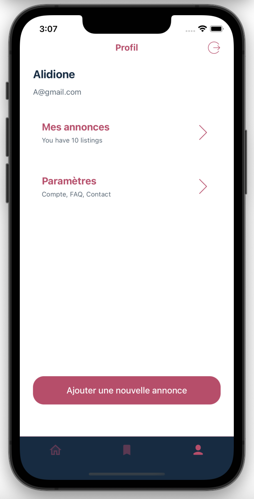

## React Native full stack cross platform application ( ios and androide )
- Javascript and React Native basics for mobile app development on Android & iOS
### Screenshots
Welcome Page  | SignUp page | SignIn |
------------- | ------------- | ------------- 
  |  | 

Items Page  | Details article - ajouter favoris - contact le vendeur | Search Categories |
------------- | ------------- | ------------- 
  |  | 

Supprimer - ajouter favorit  | Favoris | Parametre profil et ajouter des articles |
------------- | ------------- | ------------- 
  |  | 

Modifier mes informations perso  | Ajouter une nouvelle annonce | Deconnexion|
------------- | ------------- |  ------------- |
  |  | 

## Technologies and configuration environnement 
- [React Native ](https://reactnative.dev) - learn more about React Native.
- [React Native Google Signup](https://www.npmjs.com/package/@react-native-google-signin/google-signin) - learn more about React Native Google Authentification.
- [React Native Config](https://github.com/lugg/react-native-config) learn more about React Native Config.
- [Google console cloud](https://console.cloud.google.com/) - learn more about google console cloud.
- [React Navigation](https://reactnavigation.org/) - learn more about react navigation.
- [React Navigation](https://www.npmjs.com/package/react-native-image-picker) - learn more about react-native-image-picker.
- [Axios for API](https://github.com/qiangmao/axios) - learn more about Axios.
- [React Native async storage](https://reactnative.directory/?search=storage) - learn more about React Native async storage.
