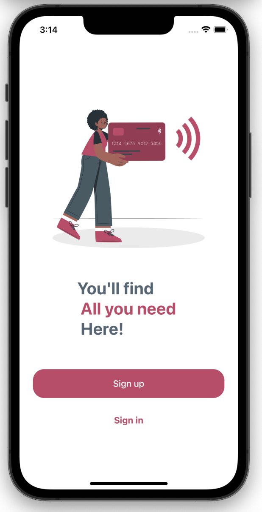
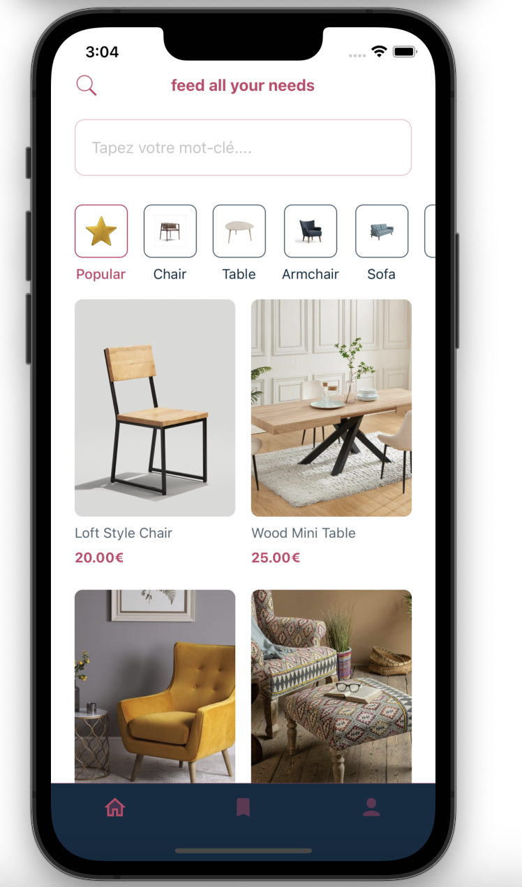
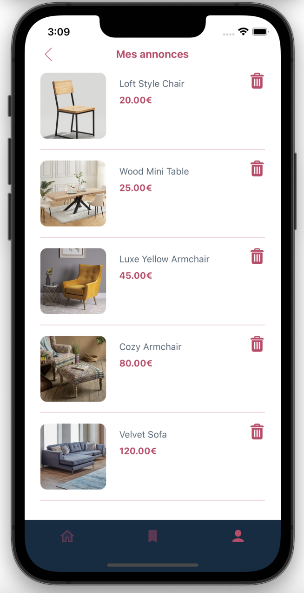

# React Native full stack cross platform application

## Screenshots
Welcome Page  | SignUp page | SignIn |
------------- | ------------- | ------------- 
  |  | 

Items Page  | Details article | Search Categories |
------------- | ------------- | ------------- 
  |  | 

Supprimer - ajouter favorit  | Favoris | Parametre profil et ajouter des articles |
------------- | ------------- | ------------- 
  |  | 

Modifier mes informations perso  | Ajouter une nouvelle annonce | Deconnexion|
------------- | ------------- |  ------------- |
  |  | 

## Technologie configuration environnement 
- [React Native Website](https://reactnative.dev) - learn more about React Native.
- - [React Native Google Authentification](https://reactnative.dev) - learn more about React Native.
